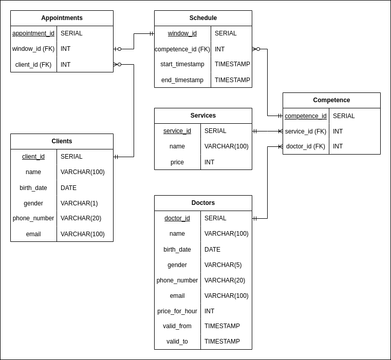

# Поликлиника

Цель проекта: создать базу данных для хранения записей пациентов на приём.

База данных для учёта записи на приём в поликлинику.
Функционал:
1) Добавление пациента в базу клиентов
2) Добавление врача в базу врачей
4) Добавление услуг в базу услуг
5) Добавление компетенций для врача
6) Изменение актуального расписания
7) Запись на приём клиента

## Концептуальная модель

## Логическая модель

## Физическая модель

## Таблицы
### Clients - таблица посетителей
| Поле | Пояснение | 
|-------------|-------------|
| name    | ФИО   |
| birth_day    | Дата рождения    |
| gender  | Пол    |
| phone_number | Номер телефона |
| email | Почта |

### Doctors - таблица докторов
| Поле | Пояснение | 
|-------------|-------------|
| name    | ФИО   |
| birth_day    | Дата рождения    |
| gender  | Пол    |
| phone_number | Номер телефона |
| email | Почта |
| price_for_hour | Стоимость часа работы |

### Services - таблица услуг
| Поле | Пояснение | 
|-------------|-------------|
|name|Наименование услуги|
|price|Цена услуги|

### Competence - таблица компетенций
Нужна для связи между докторами и услугами,
которы они могут предоставлять

| Поле | Пояснение | 
|-------------|-------------|
| service_id | Номер услуги |
| doctor_id | Номер доктора |

### Schedule - таблица расписания
Таблица доступных приёмов

| Поле | Пояснение | 
|-------------|-------------|
| competence_id | Номер компетенции |
| start_timestamp | Дата-время начала |
| end_timestamp | Дата-время конца |

### Appointments - таблица записей
Таблица с активными записями
| Поле | Пояснение | 
|-------------|-------------|
| window_id | Номер приёма в расписании |
| client_id | Номер посетителя |

## Пояснения
1) Выбрал тип версионирования SCD2, потому что он лучше всего подходит для хранения расписания. Промежуток времени, когда окно записи валидно совпадает с промежутком времени, когда запись в таблице валидна.

2) Основная часть БД - таблица с записями на приём. Она хранит человека и ячейку расписания, которую он посещает. У одной записи может быть ровно один человек, в то время как у одного человека может быть 0 и более записей. Так же у одной записи ровно одна ячейка расписания, в то время как у ячейки расписания 0 или 1 запись.

3) Таблица с расписанием хранит время записи и компетенцию. У одной ячейки расписания ровно 1 компетенция, но у одной компетенции может быть 0 или более ячеек расписания.

3) Таблица компетенций хранит пары врач-услуга.
У каждого врача может быть 1 или более услуг, у каждой услугу 1 или более врачей.

